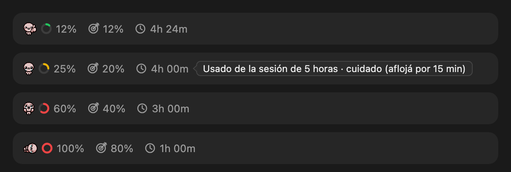

# usage-pace

Un mod para Claude Code que muestra, arriba del input, cuánto llevás usado de la sesión de 5 horas, cuánto deberías llevar a esta altura y cuánto falta para el reset. Isaac te avisa si estás quemando tokens.



## Qué muestra

| Elemento | Qué es |
|---|---|
| Isaac | Reacciona al ritmo: pulgar arriba (verde), tranquilo (amarillo), gritando (rojo), tirado en el piso (100% usado) |
| Anillo + `34%` | Usado de la sesión de 5 horas. El anillo se llena con el % y toma el color del semáforo: verde si vas igual o por debajo de lo esperado, amarillo hasta `yellowMargin` puntos por encima, rojo más allá. Durante los primeros `graceMinutes` nunca marca rojo |
| Diana + `20%` | Lo que correspondería haber usado según el tiempo transcurrido |
| Reloj + `2h 41m` | Tiempo hasta el reset |
| Flecha circular | La ventana se reinició; se actualiza con la próxima respuesta |

Al pasar el mouse sobre un valor aparece al instante un tooltip con su descripción. Cuando vas por encima del ritmo, el tooltip del anillo dice cuánto tiempo aflojar para volver a verde. La terminal muestra la misma información en una línea con emojis, sin tooltips:

```
🟢 34% 🎯 20% ⏳ 2h 41m
```

**Cuándo se actualiza:** el % usado llega con las respuestas de la API en la sesión (Claude Code avisa al terminar cada turno o cuando sube un punto entero). El tiempo restante y el % esperado se recalculan cada 60 segundos.

Se oculta si usás una API key en lugar de una suscripción, o si todavía no hubo ninguna respuesta en la sesión.

## Instalación

El mod se instala desde el marketplace [`gontzalo`](https://github.com/diazgonza17/claude-plugins). En Claude Code:

```
/plugin marketplace add diazgonza17/claude-plugins
/plugin install usage-pace@gontzalo
```

O desde la terminal:

```bash
claude plugin marketplace add diazgonza17/claude-plugins
claude plugin install usage-pace@gontzalo
```

También podés pedírselo a Claude: *"Instalá el mod usage-pace de github.com/diazgonza17/usage-pace"*. Claude sigue las instrucciones de la sección siguiente y lo deja configurado en tu idioma.

El widget aparece arriba del input en la próxima sesión, después de la primera respuesta.

## Instrucciones para Claude

Si sos Claude y te pidieron instalar este mod:

1. Elegí el idioma del mod (`es` o `en`) según el idioma en el que el usuario te escribe en esta conversación. No uses el idioma del sistema. Si no está claro, preguntale.
2. Agregá el marketplace e instalá el plugin pasando el idioma:
   ```bash
   claude plugin marketplace add diazgonza17/claude-plugins
   claude plugin install usage-pace@gontzalo --config language=<es|en>
   ```
3. Decile que el widget aparece arriba del input en la próxima sesión, después de la primera respuesta, y que el idioma y los umbrales se cambian con `/plugin configure usage-pace@gontzalo`.

## Configuración

Con `/plugin configure usage-pace@gontzalo` en Claude Code, o pidiéndoselo a Claude:

| Opción | Por defecto | Qué hace |
|---|---|---|
| `language` | `es` | Idioma de los tooltips: `es` o `en` |
| `yellowMargin` | `10` | Puntos por encima de lo esperado que se toleran en amarillo antes de pasar a rojo |
| `graceMinutes` | `15` | Minutos al inicio de la ventana en los que nunca se marca rojo |

## Actualizar

```
/plugin marketplace update gontzalo
```

## Desarrollo

```bash
claude plugin validate .
claude plugin test .
python3 scripts/build-preview.py
python3 scripts/build-demo.py
python3 scripts/build-stage.py
```

- `validate` revisa el mod y lista todo lo que llama.
- `test` corre los tests de la lógica, los textos y el dibujo.
- `build-preview.py` dibuja con el código del plugin cada estado de ejemplo y regenera [`docs/preview.html`](docs/preview.html), con la versión desktop en los dos idiomas (con tooltips al pasar el mouse) y la de terminal, y la captura `docs/screenshot.png` si tenés Chrome instalado.
- `build-demo.py` arma [`docs/demo.gif`](docs/demo.gif): los cuatro estados con sus tooltips, en inglés, para compartir. Necesita Chrome y Pillow.
- `build-stage.py` genera [`docs/stage.html`](docs/stage.html), una página para grabar la pantalla: alterna los cuatro estados cada 2 segundos sobre una réplica del input de Claude Code, con los tooltips reales al pasar el mouse. Espacio pausa, ← → cambian de estado, L cambia el idioma.

Regenerá estos archivos cuando cambies el dibujo o los textos.

**Publicar una versión:** subí `version` en `.claude-plugin/plugin.json` y hacé push a `main`. A los usuarios solo les llega cuando cambia la versión, así que los commits intermedios no se publican.

Los textos de cada idioma están en `hooks/i18n.ts`.

Los sprites de Isaac están en `assets/isaac/`. El módulo no lee archivos y el desktop descarta imágenes embebidas, así que `hooks/sprites.ts` los guarda convertidos a vectores. Si cambiás un PNG, regeneralo con `python3 scripts/build-sprites.py` (necesita Pillow).

## Licencia

[MIT](LICENSE)
